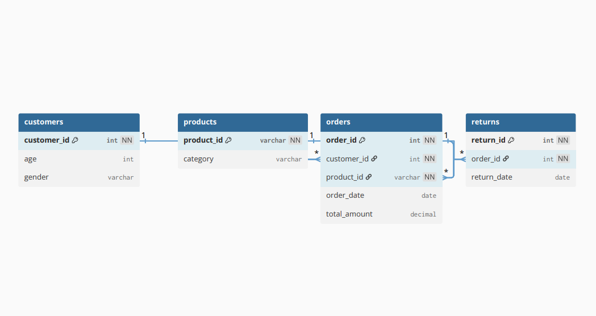

# Entity Relationship Diagram (ERD)

---

## Overview

This diagram represents the relational data model used in this project.  
The dataset was transformed from a raw staging table into a normalized schema to support efficient querying and accurate analysis.

---

## Data Model Structure

The schema is centered around the **orders** table, which connects customers, products, and returns.

---

## Key Relationships

- A **customer** can place multiple orders  
- A **product** can appear in multiple orders  
- Each **order** is associated with one customer and one product  
- Each **order** can have at most one corresponding return  

---

## Design Rationale

- **Normalization** reduces data redundancy and improves consistency  
- **Clear relationships** enable efficient joins across entities  
- **Separation of concerns** allows independent analysis of customers, products, and returns  
- **Return linkage** ensures accurate calculation of revenue loss  

---

## Analytical Impact

This data model enables:

- Revenue and return loss calculations  
- Product-level and category-level performance analysis  
- Customer behavior and risk segmentation  
- Scalable and maintainable SQL queries  

---
